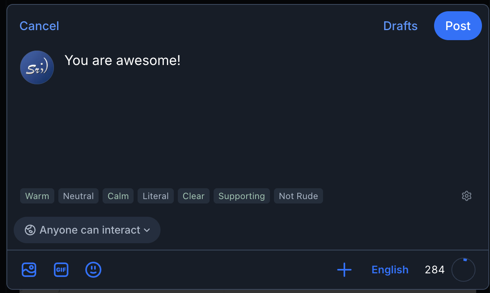
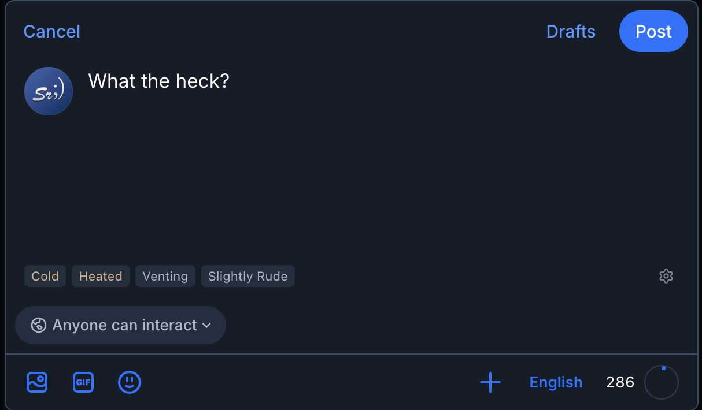
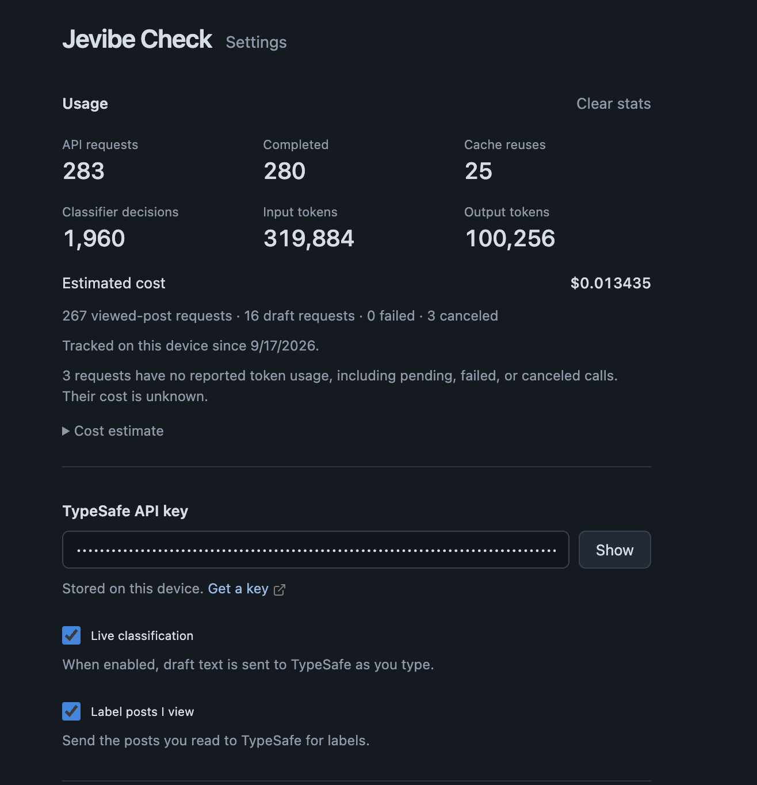
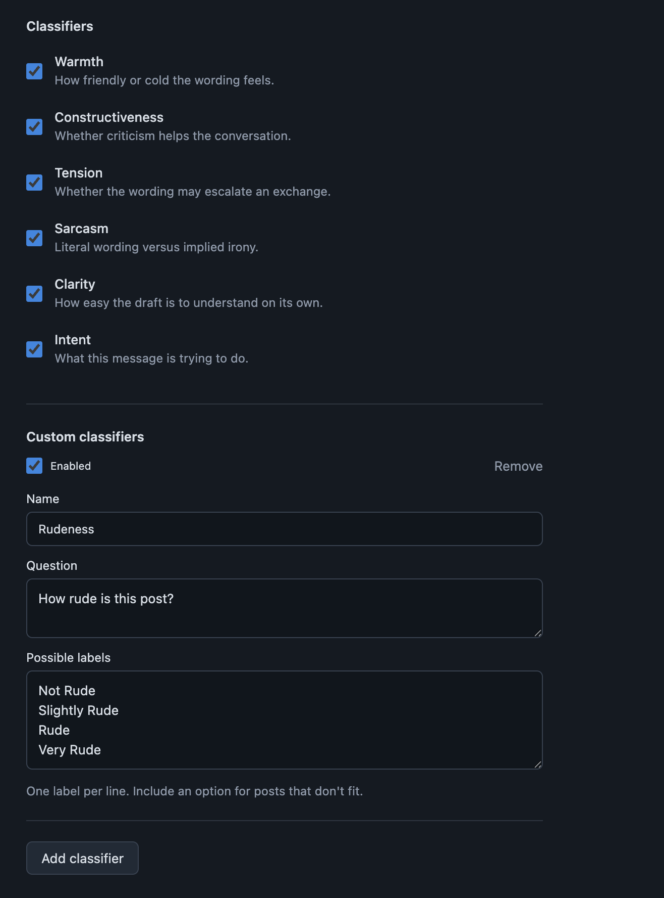
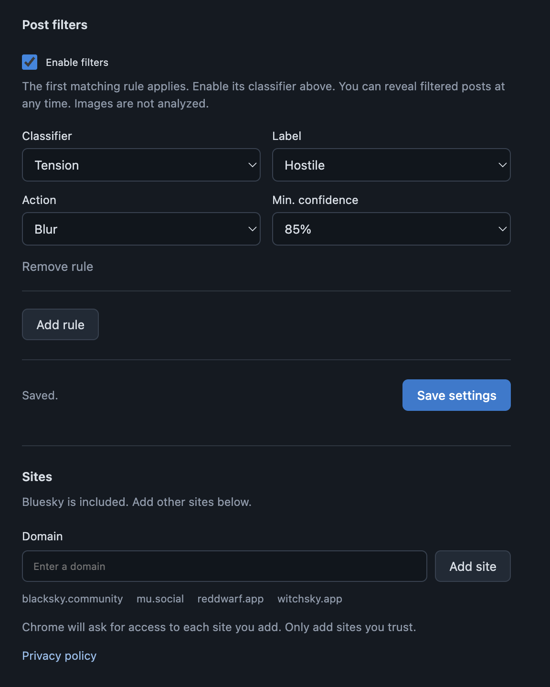

<h1> Jevibe Check</h1>

A live tone labeler for Bluesky posts and drafts, using [TypeSafe's Jev](https://typesafe.ai/blog/introducing-system-one-models-and-jev) API.

- See warmth, constructiveness, tension, sarcasm, clarity, and intent while browsing or typing.
- Add custom classifiers with your own questions and labels.
- Blur or collapse posts that match your filters.
- Track API requests, token usage, and estimated cost.

Labels are based on text only. Attached images and videos are not analyzed.

## Demo


## Examples

<table>
  <tr>
    <td></td>
    <td></td>
  </tr>
</table>

The rudeness labels shown above are from a custom classifier.

<details>
<summary>Post labels and blur filter</summary>


</details>

## Install

You need Chrome 130 or newer and a [TypeSafe API key](https://console.typesafe.ai). TypeSafe charges for API usage.

1. Download or clone this repo.
2. Open `chrome://extensions` and turn on **Developer mode**.
3. Click **Load unpacked** and select the `extension` folder.
4. Open Jevibe Check from Chrome's extensions menu, enter your API key, and save.
5. Refresh Bluesky.

No build step is needed. Reload the extension and refresh your tabs after an update.

## Settings

Draft labels and labels on posts you read can be turned on or off separately. Choose which classifiers to run, or add a custom one with a question and 2–12 possible labels. Results below 55% model confidence are hidden.

Filters are off by default. To add one, select a classifier, a label, a minimum confidence, and **Blur** or **Collapse**. Enable that classifier too. You can reveal filtered posts at any time.

Add other domains under **Sites** and grant Chrome access. Some sites need custom CSS selectors under **Site detection**.

**Usage** shows request counts and estimated cost. Set token prices under **Cost estimate**, or use **Clear stats** to reset the counters. Your key and settings are kept. Check TypeSafe for actual charges.

<details>
<summary>Settings screenshots</summary>







</details>

## Privacy

Enabled features send draft or post text and your classifier definitions directly to TypeSafe. Only text is analyzed; images and surrounding conversations are not included. Your API key is stored locally in Chrome and is not shared with website scripts.

Labels are not posted to Bluesky, but scripts on the page can read them. Only grant access to sites you trust. There is no developer server, analytics, or saved post history.

Read the [privacy policy](extension/privacy.html) for details.

## Development

```sh
npm ci
npx playwright install chromium
npm test
```

## License

[MIT](LICENSE). Icons are from [Lucide](https://lucide.dev) and carry their [own license](extension/icons/LICENSE).
